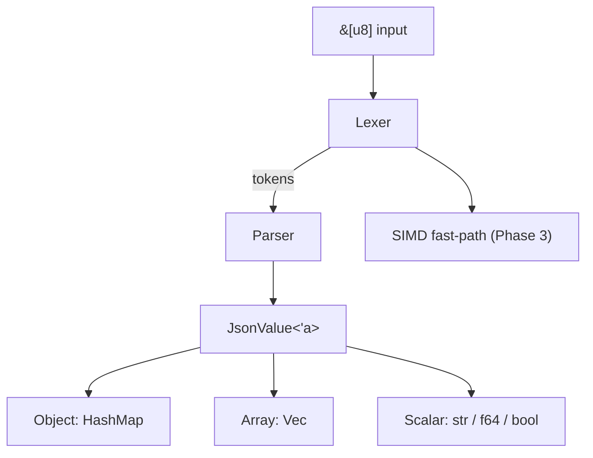

# rust-json-parser — State File

> Maintained by ClaudeState.

| Field | Value |
|---|---|
| **Goal** | Build a zero-copy JSON parser in Rust with SIMD acceleration |
| **Language** | Rust |
| **Created** | 2025-01-15 |
| **Last Updated** | 2025-01-22 14:30 |

---

## Current Status

**Active Phase:** Phase 2 — Core Parser Implementation

---

## Roadmap

### Phase 1 — Setup [complete]
- [x] Initialise Cargo workspace
- [x] Set up CI with GitHub Actions
- [x] Configure clippy + rustfmt
- [x] Benchmark harness (criterion)

### Phase 2 — Core Parser
- [x] Lexer: tokenise JSON bytes
- [ ] Parser: recursive descent for objects/arrays
- [ ] Zero-copy string slices (&str over String)
- [ ] Error types with byte-offset reporting

### Phase 3 — SIMD Acceleration
- [ ] Detect string boundaries with SSE2
- [ ] Whitespace skipping via SIMD
- [ ] Benchmarks vs serde_json / simd-json

### Phase 4 — Release
- [ ] Docs.rs documentation
- [ ] Fuzz testing (cargo-fuzz)
- [ ] Publish to crates.io v0.1.0

---

## Architecture

---

## Token Budget

| Session | Tokens Used | Task |
|---|---|---|
| 2025-01-15 | ~1,200 | Setup + CI |
| 2025-01-18 | ~2,800 | Lexer implementation |
| 2025-01-22 | ~900 | Loaded only `src/lexer.rs` for debug |

**Total:** ~4,900 tokens saved by lazy context loading.

---

## Blockers

*(none)*

---

## Changelog

- [2025-01-22] Completed lexer; moving to recursive descent parser
- [2025-01-18] Benchmark harness shows 2.1x faster than serde_json on small payloads
- [2025-01-15] Project initialised with ClaudeState
